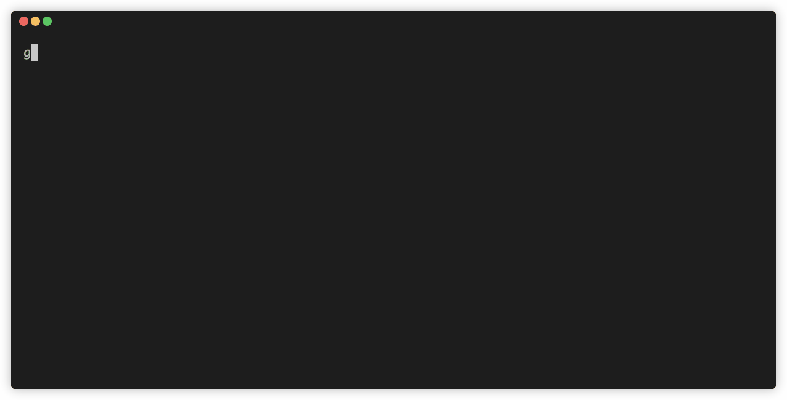
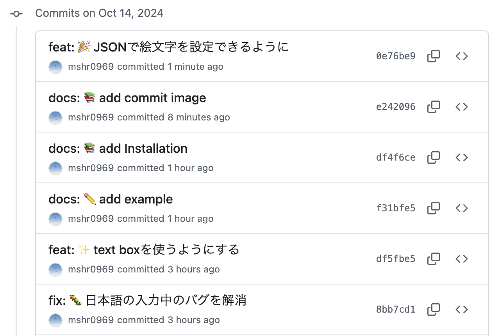

# simple-git-cz
gitのコミットメッセージを簡単に書くためのCLIツール

## Example



## Features
- コミットメッセージにつけるprefixを選んで入力を行う
- prefixに付く絵文字は`emojis.json`で設定し、ランダムで表示される
```json
{
  "feat": ["✨", "🚀", "🎉"],
  "fix": ["🐛", "🔧", "🚑️"],
  "docs": ["📚", "✏️", "📝"],
  "style": ["🎨", "💄", "🎯"],
  "refactor": ["♻️", "🛠️", "🔄"],
  "perf": ["⚡", "🔥", "💨"],
  "test": ["✅", "🧪", "📊"],
  "chore": ["🧹", "📦", "🔒"]
}
```

## Installation

### バイナリをビルド
```bash
go build -o simple-git-cz
```

### 適切な場所に配置
```bash
sudo mv simple-git-cz /usr/local/bin
```

### `emojis.json`のpathを環境変数に設定
` ~/.bashrc` や `~/.zshrc` への追加
```bash
export EMOJI_FILE=/path/to/your/emojis.json
```

### 動かす
```bash
simple-git-cz
```
※ サンプルのGifではエイリアスで`gc`を設定している
