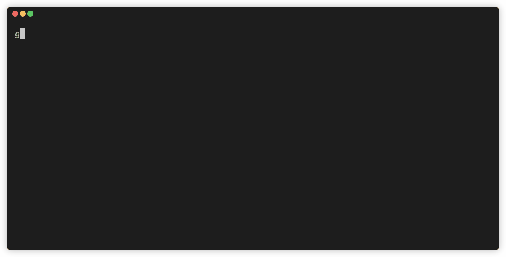

# simple-git-cz
gitのコミットメッセージを簡単に書くためのCLIツール

## Example


## Features
- コミットメッセージにつけるprefixを選んで入力を行う
- prefixに付く絵文字は`emojiMap`で設定し、ランダムで表示される
```go
var emojiMap = map[string][]string{
	"feat":     {"✨", "🚀", "🎉"},
	"fix":      {"🐛", "🔧", "🚑️"},
	"docs":     {"📚", "✏️", "📝"},
	"style":    {"🎨", "💄", "🎯"},
	"refactor": {"♻️", "🛠️", "🔄"},
	"perf":     {"⚡", "🔥", "💨"},
	"test":     {"✅", "🧪", "📊"},
	"chore":    {"🧹", "📦", "🔒"},
}
```

## Installation

### バイナリをビルド
```bash
go build -o simple-git-cz
```

### 適切な場所に配置
```bash
sudo mv simple-git-cz /usr/local/bin
```

### 動かす
```bash
simple-git-cz
```
※ サンプルのGifではエイリアスで`gc`を設定している
